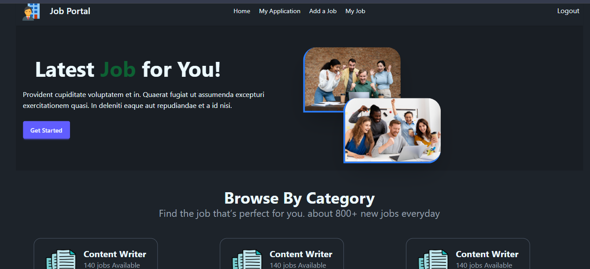
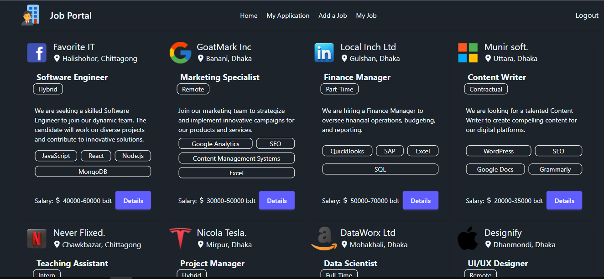
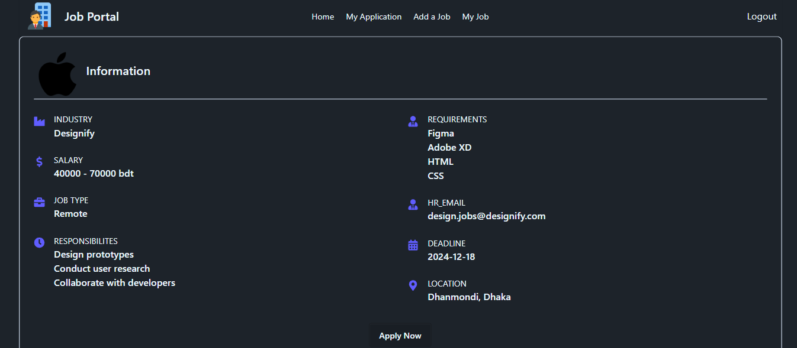

# 💼 Job Portal — Full Stack Web Application

A modern, full-featured job portal built with **React**, **Firebase Authentication**, and a **Node.js/Express** backend. Job seekers can browse and apply for jobs, while employers can post and manage listings.

---

##  Live Demo

https://job-portal-4909c.web.app

---

##  Screenshots





---

##  Features

###  Authentication
- Email & Password Registration / Login
- Google Sign-In via Firebase
- JWT-based session management with HTTP-only cookies
- Protected routes with auto-redirect on 401/403

### Job Seeker
- Browse all hot/featured jobs
- View detailed job info (salary, type, location, responsibilities, requirements)
- Apply with LinkedIn, GitHub, and Resume URL
- Track and manage submitted applications (with delete)

### Employer
- Post new job listings with full details
- View all self-posted jobs
- See application count per job
- Review all applicants for a specific job

---

##  Tech Stack

| Layer | Technologies |
|---|---|
| **Frontend** | React 18, React Router v6, Tailwind CSS, DaisyUI |
| **Animations** | Framer Motion (motion/react), Lottie React |
| **Auth** | Firebase Authentication (Email + Google OAuth) |
| **HTTP Client** | Axios (with interceptors for auth) |
| **Icons** | React Icons |
| **Backend** | Node.js, Express.js |
| **Database** | MongoDB |
| **Auth Tokens** | JWT via HTTP-only cookies |

---


##  Getting Started

### Prerequisites
- Node.js v18+
- npm or yarn
- A Firebase project
- A running instance of the [backend server](https://job-portal-server-six-theta.vercel.app)

### Installation

```bash
# 1. Clone the repository
git clone https://github.com/your-username/job-portal-client.git
cd job-portal-client

# 2. Install dependencies
npm install

# 3. Configure environment variables
cp .env.example .env.local
# Fill in your Firebase config keys
```

### Run Locally

```bash
npm run dev
```

The app will be available at `http://localhost:5173`

---


##  Security

- JWT tokens stored in **HTTP-only cookies** (not localStorage)
- Axios interceptor auto-logs out on `401`/`403` responses
- Protected routes redirect unauthenticated users to `/login`
- Original path preserved via React Router `state` for post-login redirect

---

##  Known Issues / TODO

- [ ] Add profile picture upload on registration
- [ ] Improve loading state UX (skeleton loaders)
- [ ] Email notifications on application status change

---

##  Contributing

Pull requests are welcome! For major changes, please open an issue first to discuss what you'd like to change.

---

##  License

This project is open source and available under the [MIT License](LICENSE).

---

##  Author

**Your Name**
- GitHub: [@your-username](https://github.com/your-username)
- LinkedIn: [your-linkedin](https://linkedin.com/in/your-linkedin)
